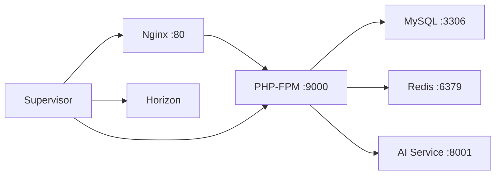

# AUREX Setup Guide

## Table of Contents

1. [Development Setup](#1-development-setup)
2. [Docker Production Deployment](#2-docker-production-deployment)
3. [Queue & Horizon Monitoring](#3-queue--horizon-monitoring)
4. [Performance Monitoring (Pulse)](#4-performance-monitoring-pulse)
5. [Error Tracking (Sentry)](#5-error-tracking-sentry)
6. [Production Optimization](#6-production-optimization)

---

## 1. Development Setup

### Prerequisites

| Tool | Version | Notes |
|------|---------|-------|
| PHP | 8.2+ | With extensions: pdo_mysql, mbstring, gd, zip, bcmath, redis |
| Composer | 2.x | |
| MySQL | 8.0+ | |
| Redis | 7.x | Required for queue, cache, session |
| Python | 3.9+ | For AI Service |
| Flutter | 3.29+ | With Dart SDK |
| Node.js | 20+ | For Laravel assets (Vite) |
| Docker | 24+ | Optional — for production deployment |

### 1.1 Backend Setup (Laravel)

```bash
cd backend/laravel_api

# Install PHP dependencies
composer install

# Copy environment file and configure
cp .env.example .env

# Edit .env — set DB credentials, APP_URL, AI_SERVICE_API_KEY
# Ensure QUEUE_CONNECTION=redis for queue support

# Generate APP_KEY
php artisan key:generate

# Run database migrations
php artisan migrate

# Install & publish Pulse (performance monitoring)
php artisan vendor:publish --provider="Laravel\Pulse\PulseServiceProvider"
php artisan migrate

# Start development server
php artisan serve
```

### 1.2 AI Service Setup (FastAPI)

```bash
cd ai_service/python_ai

# Create virtual environment
python -m venv venv
# Linux/macOS:
source venv/bin/activate
# Windows:
.\venv\Scripts\activate

# Install dependencies
pip install -r requirements.txt

# Set API key (must match AI_SERVICE_API_KEY in Laravel .env)
export AI_SERVICE_API_KEY=aurex-ai-dev-key-2026

# Start service (runs on http://localhost:8001)
python main.py
```

### 1.3 Mobile App Setup (Flutter)

```bash
cd mobile_app/flutter_app

# Install dependencies
flutter pub get

# Run on connected device/emulator
flutter run

# Run tests
flutter test
```

### 1.4 Project Structure — Form Request & API Resource

AUREX menggunakan **Form Request classes** untuk validasi terpusat dan **API Resource classes** untuk response konsisten.

#### Form Request Classes (7 files)

Lokasi: `backend/laravel_api/app/Http/Requests/`

| Class | Endpoint | Validasi Utama |
|-------|----------|----------------|
| `RegisterRequest` | `POST /api/register` | name required, email unique, password min:8 confirmed |
| `LoginRequest` | `POST /api/login` | email required, password required |
| `UploadSelfieRequest` | `POST /api/upload-selfie` | image required, mimes:jpeg/png/jpg, max:5MB |
| `AnalyzeRequest` | `POST /api/analyze` | image_id required, exists:images,id |
| `ForgotPasswordRequest` | `POST /api/forgot-password` | email required, exists:users |
| `ResetPasswordRequest` | `POST /api/reset-password` | email+token+password required, min:8 confirmed |
| `ResendVerificationRequest` | `POST /api/resend-verification` | email required, exists:users |

Semua Form Request memiliki:
- `authorize()` — authorization check (default: true)
- `rules()` — validation rules array
- `messages()` — pesan error dalam Bahasa Indonesia

#### API Resource Classes (5 files)

Lokasi: `backend/laravel_api/app/Http/Resources/`

| Class | Response | Field yang di-expose |
|-------|----------|---------------------|
| `UserResource` | User profile | id, name, email, email_verified_at, created_at |
| `AnalysisResource` | Analysis detail | id, user_id, face_shape, undertone, style_score, recommendation |
| `AnalysisCollection` | History list | data (array AnalysisResource) + pagination metadata |
| `RecommendationResource` | Style recommendation | hairstyle, color_palette, outfit (default [] jika null) |
| `ImageResource` | Uploaded image | id, user_id, analysis_id, image_path, image_url, created_at |

API Resources memastikan response format konsisten dan field sensitif (password, remember_token) tidak terexpose.

### 1.5 Running Tests

AUREX memiliki total **183 tests** (134 backend + 49 Flutter):

```bash
# Backend tests (134 tests)
cd backend/laravel_api
php artisan test

# Run specific test suite
php artisan test --testsuite=Feature
php artisan test --testsuite=Unit
php artisan test --filter=FormRequestTest
php artisan test --filter=ApiResourceTest

# Flutter tests (49 tests)
cd mobile_app/flutter_app
flutter test

# AI Service tests
cd ai_service/python_ai
python -m pytest --tb=short
```

### 1.6 Queue Worker (Development)

For local queue processing (job dispatches, email sending):

```bash
cd backend/laravel_api

# Process jobs synchronously (default, no worker needed)
# If using Redis queue:
php artisan queue:work redis --tries=3
```

---

## 2. Docker Production Deployment

### 2.1 Prerequisites

- Docker Engine 24+ & Docker Compose v2+
- `.env` file in project root (copy from `.env.example`)

### 2.2 Production Environment Variables

Create `.env` file in the project root:

```bash
cp .env.example .env
```

Required values:

| Variable | Description | Default |
|----------|-------------|---------|
| `APP_KEY` | Laravel app key (generate below) | **Required** |
| `DB_PASSWORD` | MySQL user password | `aurex_secret_2026` |
| `DB_ROOT_PASSWORD` | MySQL root password | `root_secret_2026` |
| `AI_SERVICE_API_KEY` | Shared API key for AI service | `aurex-ai-dev-key-2026` |
| `SENTRY_DSN` | Sentry DSN for error tracking | *(optional)* |

Generate APP_KEY:

```bash
cd backend/laravel_api
php artisan key:generate --show
# Copy output to APP_KEY in root .env
```

### 2.3 Start All Services

```bash
# From project root
docker-compose up -d

# Check status
docker-compose ps

# View logs
docker-compose logs -f
```

### 2.4 Service Endpoints

| Service | URL | Container |
|---------|-----|-----------|
| Laravel API | `http://localhost:8000` | `aurex-laravel` |
| MySQL | `localhost:3307` | `aurex-mysql` |
| Redis | `localhost:6379` | `aurex-redis` |
| AI Service | `http://localhost:8001` | `aurex-ai-service` |
| Pulse Dashboard | `http://localhost:8000/pulse` | `aurex-laravel` |
| Horizon Dashboard | `http://localhost:8000/horizon` | `aurex-laravel` |

### 2.5 Docker Compose Architecture



Key points:
- **Nginx** serves static files and proxies PHP requests to PHP-FPM
- **PHP-FPM** runs Laravel with OPcache + JIT enabled
- **Supervisor** manages: Nginx, PHP-FPM, Horizon (queue)
- **Horizon** replaces `queue:work` — manages worker processes, auto-scaling, monitoring dashboard
- **Redis** stores cache, sessions, and queue jobs

### 2.6 Building Images

```bash
# Build without cache
docker-compose build --no-cache

# Or build individual services
docker-compose build laravel
docker-compose build ai-service
```

---

## 3. Queue & Horizon Monitoring

### 3.1 What is Laravel Horizon?

Horizon provides a real-time dashboard for monitoring Redis queues. It manages worker processes with auto-scaling and provides metrics on:

- Job throughput (processed per minute/hour)
- Failed jobs with stack traces
- Job wait times per queue
- Recent completed jobs
- Worker process count & status

### 3.2 Dashboard Access

**URL:** `http://localhost:8000/horizon`

Access is restricted in production. Only users with emails listed in `app/Providers/HorizonServiceProvider.php` can view the dashboard:

```php
protected function gate(): void
{
    Gate::define('viewHorizon', function ($user) {
        return in_array($user->email, [
            'admin@aurex.app',
            // Add more admin emails as needed
        ]);
    });
}
```

### 3.3 Queue Configuration

See `config/horizon.php` for full configuration. Key settings:

| Setting | Production | Staging | Description |
|---------|-----------|---------|-------------|
| `maxProcesses` | 10 | 3 | Max worker processes |
| `balance` | `auto` | `auto` | Auto-scaling strategy |
| `tries` | 3 | 3 | Retry attempts per job |
| `timeout` | 300s | 300s | Max job execution time |
| `queue` | default, high, low | default | Queue names to monitor |

### 3.4 Supervisor Configuration

In Docker, Horizon runs via Supervisor (see `docker/supervisor/supervisord.conf`):

```ini
[program:horizon]
command=php /var/www/html/artisan horizon
autostart=true
autorestart=true
user=www-data
stopwaitsecs=3600  ; Graceful shutdown — allows jobs to finish during deploy
```

**Important:** `stopwaitsecs=3600` gives workers up to 1 hour to finish in-progress jobs before force-kill during deployment.

### 3.5 Deploying with Horizon

When deploying new code:

```bash
# Inside Docker container — gracefully terminate Horizon (waits for jobs to finish)
docker exec aurex-laravel php artisan horizon:terminate

# Or from Supervisor inside container:
docker exec aurex-laravel supervisorctl restart horizon

# Supervisor will auto-restart Horizon with new code
```

### 3.6 Monitoring Tips

- **Queue wait time:** Keep an eye on `waits` in the dashboard. If a job waits >60s, consider increasing workers
- **Failed jobs:** Horizon persists failed jobs with stack traces for 7 days (configurable in `config/horizon.php`)
- **Metrics charts:** Hourly snapshots show throughput trends
- **Notifications:** Configure email/Slack/SMS alerts for long waits or failures

---

## 4. Performance Monitoring (Pulse)

### 4.1 What is Laravel Pulse?

Pulse provides real-time performance monitoring for your Laravel application:

- **Server metrics:** CPU, memory, disk usage (requires `pulse:check` daemon)
- **Application metrics:** Slow endpoints, slow queries, slow jobs
- **Cache hits/misses**
- **User activity**

### 4.2 Dashboard Access

**URL:** `http://localhost:8000/pulse`

Access is restricted in production. Configure in `app/Providers/AppServiceProvider.php`:

```php
Gate::define('viewPulse', function (User $user) {
    return in_array($user->email, [
        'admin@aurex.app',
    ]);
});
```

### 4.3 Running Pulse in Production

Pulse requires a background daemon for server metrics:

```bash
# Start the check daemon
php artisan pulse:check

# In Docker, this runs via Supervisor as part of schedule-runner
# See docker/supervisor/supervisord.conf
```

In the `bootstrap/app.php`, Pulse is scheduled to run every minute:

```php
$schedule->command('pulse:check')->everyMinute()->withoutOverlapping();
```

### 4.4 Pulse Configuration

Key settings in `config/pulse.php` (published via `vendor:publish`):

- **Database:** Uses the same MySQL database as the app (PULSE_DB_CONNECTION)
- **Ingest:** Can be configured to use Redis for high-traffic apps
- **Records retention:** Configurable per card type

### 4.5 Disabling Pulse

Pulse is automatically disabled in tests via `phpunit.xml`:

```xml
<env name="PULSE_ENABLED" value="false"/>
```

For local development without Pulse, set:

```env
PULSE_ENABLED=false
```

---

## 5. Error Tracking (Sentry)

### 5.1 What is Sentry?

Sentry captures application errors and exceptions in real-time, providing:

- Stack traces with source context
- User/browser/OS information
- Performance tracing (slow transactions)
- Release tracking

### 5.2 Laravel Setup

```bash
# Install Sentry (already in composer.json)
cd backend/laravel_api
composer install

# Configure in .env
SENTRY_LARAVEL_DSN=https://your-dsn@oXXXXX.ingest.sentry.io/XXXXX
SENTRY_TRACES_SAMPLE_RATE=0.2   # 0.0 - 1.0 (lower in production)
SENTRY_SEND_DEFAULT_PII=true
```

Sentry integration is configured in `bootstrap/app.php`:

```php
->withExceptions(function (Exceptions $exceptions) {
    $exceptions->reportable(function (Throwable $e) {
        if (app()->bound('sentry')) {
            app('sentry')->captureException($e);
        }
    });

    if (class_exists(\Sentry\Laravel\Integration::class)) {
        \Sentry\Laravel\Integration::handles($exceptions);
    }
})
```

**Note:** The `class_exists()` guard ensures graceful fallback if Sentry is not installed.

### 5.3 Flutter Setup

```bash
cd mobile_app/flutter_app
flutter pub get
```

Sentry is configured in `lib/main.dart`:

```dart
await SentryFlutter.init(
  (options) {
    options.dsn = const String.fromEnvironment('SENTRY_DSN', defaultValue: '');
    options.tracesSampleRate = 0.2;
  },
  appRunner: () => runApp(
    const ProviderScope(child: AurexApp()),
  ),
);
```

The DSN is passed via `--dart-define` during build:

```bash
flutter build apk --release --dart-define=SENTRY_DSN=https://your-dsn@sentry.io/xxx
```

### 5.4 Best Practices

- **Set `tracesSampleRate` to 0.1-0.2** in production to control costs
- **Use environment names** (`production`, `staging`) to filter issues
- **Configure release tracking** via `SENTRY_RELEASE` env var
- **Test configuration** with: `php artisan sentry:test`

---

## 6. Staging Deployment ke VPS / Cloud

### 6.1 Prasyarat Infrastruktur

Untuk deployment staging, Anda memerlukan:

| Resource | Spesifikasi Minimal | Rekomendasi |
|----------|-------------------|-------------|
| **VPS** | 2 vCPU, 4GB RAM, 50GB SSD | DigitalOcean / Linode / Vultr $12-24/bln |
| **Docker** | Docker Engine 24+ & Compose v2 | `curl -fsSL https://get.docker.com | sh` |
| **Domain** | (opsional) | `staging-api.aurex.app` → IP VPS |
| **SSH Key** | Passwordless SSH | `ssh-keygen -t ed25519` |

**Provisi VPS (DigitalOcean contoh):**

```bash
# 1. Buat Droplet di DigitalOcean (Ubuntu 24.04, 2GB RAM)
# 2. SSH ke server
ssh root@<ip-vps>

# 3. Install Docker
curl -fsSL https://get.docker.com | sh
usermod -aG docker $USER

# 4. Install Docker Compose (plugin)
apk add docker-compose  # Alpine
# atau:
snap install docker     # Ubuntu

# 5. Verifikasi
docker --version
docker compose version
```

### 6.2 Deployment Architecture

```
                     ┌──────────────┐
                     │   Nginx :80  │  Reverse Proxy
                     └──────┬───────┘
                            │
              ┌─────────────┼─────────────┐
              ▼             ▼             ▼
        ┌──────────┐ ┌──────────┐ ┌──────────────┐
        │ Laravel  │ │ Horizon  │ │ AI Service   │
        │ PHP-FPM  │ │ Queue    │ │ FastAPI      │
        │ :80      │ │ Worker   │ │ :8001        │
        └────┬─────┘ └────┬─────┘ └──────────────┘
             │            │
        ┌────▼─────┐ ┌────▼─────┐
        │  MySQL   │ │  Redis   │
        │ :3306    │ │ :6379    │
        └──────────┘ └──────────┘
```

Semua service berjalan di Docker, diatur oleh `docker-compose.staging.yml`.

### 6.3 File Konfigurasi Deployment

| File | Fungsi |
|------|--------|
| `docker-compose.staging.yml` | Docker Compose staging (resource limits, horizon worker terpisah, Nginx reverse proxy) |
| `deploy/nginx/default.conf` | Nginx config — reverse proxy ke Laravel + AI Service, security headers |
| `deploy/staging/deploy.sh` | Script deployment — upload, build, migrate, health check, rollback |
| `.github/workflows/deploy-staging.yml` | GitHub Actions — auto-deploy ke staging saat push ke branch `staging` |
| `backend/laravel_api/.env.staging` | Environment variables untuk staging |

### 6.4 Setup DNS & Domain

```bash
# 1. Arahkan domain ke IP VPS
#    Di DNS provider Anda, buat A record:
#    staging-api.aurex.app  →  <IP-VPS>

# 2. Verifikasi
ping staging-api.aurex.app
```

### 6.5 Siapkan Environment Variables

```bash
# Generate APP_KEY (di lokal)
cd backend/laravel_api
php artisan key:generate --show
# Output: base64:xxxxxxxxxxxxxxxxxxxx

# Export variables (akan dipakai oleh deploy script)
export SSH_HOST=root@staging-api.aurex.app
export APP_KEY=base64:xxxxxxxxxxxxxxxxxxxx
export DB_PASSWORD=aurex_staging_secret_2026
export AI_API_KEY=aurex-ai-staging-key-2026
export SENTRY_DSN=https://...@ingest.sentry.io/...
```

### 6.6 Deploy

```bash
# Deploy pertama
chmod +x deploy/staging/deploy.sh
./deploy/staging/deploy.sh

# Cek status deployment
./deploy/staging/deploy.sh --status

# Rollback jika ada masalah
./deploy/staging/deploy.sh --rollback
```

### 6.7 GitHub Actions Auto-Deploy

Untuk deployment otomatis via GitHub Actions:

1. **Buat branch `staging`** di GitHub
2. **Set GitHub Secrets:**

| Secret | Value |
|--------|-------|
| `SSH_PRIVATE_KEY` | Private key untuk SSH ke VPS |
| `SSH_HOST` | `root@staging-api.aurex.app` |
| `APP_KEY` | Laravel app key |
| `DB_PASSWORD` | MySQL password |
| `AI_API_KEY` | AI Service API key |
| `SENTRY_DSN` | (opsional) Sentry DSN |

3. **Push ke `staging`** → auto-deploy

### 6.8 Verifikasi Deployment

```bash
# Health check (publik)
curl https://staging-api.aurex.app/api/v1/health

# Yang dicek:
# ✅ Database connection
# ✅ Redis connection
# ✅ AI Service connection
# ✅ Application info (PHP version, Laravel version)
```

Contoh response health check:
```json
{
  "status": "degraded",
  "timestamp": "2026-07-17T12:00:00+00:00",
  "total_latency_ms": 45.23,
  "checks": {
    "database": { "status": "healthy", "latency_ms": 3.12 },
    "cache": { "status": "unhealthy", "driver": "redis", "error": "..." },
    "ai_service": { "status": "healthy", "latency_ms": 12.45 },
    "app": { "name": "AUREX", "env": "staging", "php_version": "8.3.6" }
  }
}
```

> **Catatan:** Cache akan `unhealthy` jika Redis belum dikonfigurasi — ini normal untuk deploy pertama.

### 6.9 Monitoring di Staging

Setelah deploy, akses dashboard monitoring:

| Dashboard | URL | Autentikasi |
|-----------|-----|------------|
| **Health Check** | `/api/v1/health` | Publik |
| **Pulse** | `/pulse` | Login admin |
| **Horizon** | `/horizon` | Login admin |

### 6.10 Troubleshooting

```bash
# Lihat log semua service
docker compose -f docker-compose.staging.yml logs -f

# Lihat log service tertentu
docker compose -f docker-compose.staging.yml logs laravel
docker compose -f docker-compose.staging.yml logs ai-service

# Masuk ke container Laravel
docker exec -it aurex-laravel bash

# Jalankan Artisan command di container
docker exec aurex-laravel php artisan migrate:status

# Restart semua service
docker compose -f docker-compose.staging.yml restart
```

---

## 7. Production Optimization

### 7.1 Dockerfile Optimization

The production Dockerfile (`backend/laravel_api/Dockerfile`) uses 3-stage build:

| Stage | Purpose | Base Image |
|-------|---------|------------|
| `vendor` | Install Composer deps | `composer:2.8` |
| `app` | Build Laravel cache | `php:8.3-fpm-alpine` |
| `production` | Minimal runtime image | `php:8.3-fpm-alpine` |

### 6.2 OPcache & JIT

Configured in `docker/php/opcache.ini`:

```ini
opcache.enable=1
opcache.memory_consumption=192
opcache.max_accelerated_files=10000
opcache.validate_timestamps=0      ; Production — cache until deploy
opcache.jit=tracing                 ; PHP JIT compiler
opcache.jit_buffer_size=100M        ; JIT memory allocation
```

### 6.3 Laravel Cache Commands

These run in the entrypoint script (`docker/entrypoint.sh`) at container startup:

```bash
if [ "${APP_ENV}" = "production" ]; then
    php artisan config:cache
    php artisan route:cache
    php artisan view:cache
fi
```

They are intentionally NOT run in the Docker build stage because `APP_KEY` and database credentials are only available at container runtime.

### 6.4 Composer Optimization

Production install uses:

```bash
composer install \
    --no-dev \
    --prefer-dist \
    --optimize-autoloader \
    --classmap-authoritative \
    --no-scripts
```

- `--classmap-authoritative`: Fastest autoloading (no fallback to filesystem/APC)
- `--no-dev`: Excludes development packages (Pest, PHPStan, etc.)

### 6.5 Health Checks

Each Docker service has a health check:

| Service | Health Check Command |
|---------|---------------------|
| Laravel | `curl -f http://localhost/up` |
| MySQL | `mysqladmin ping -h localhost` |
| Redis | `redis-cli ping` |
| AI Service | `wget --spider http://localhost:8001/` |

### 6.6 Security Checklist

- [ ] `APP_DEBUG=false` in production
- [ ] `APP_KEY` generated and set (required by Docker)
- [ ] `AI_SERVICE_API_KEY` matches between Laravel and AI Service
- [ ] MySQL root password changed from default
- [ ] `.env` excluded from version control (`.gitignore` handles this)
- [ ] CORS configured for specific origins (not `*`)
- [ ] Rate limiting enabled (5/min for login, 60/min for API)
- [ ] Sentry DSN configured for error tracking

### 6.7 Monitoring Checklist

- [ ] Pulse dashboard accessible (`/pulse`)
- [ ] Horizon dashboard accessible (`/horizon`)
- [ ] Queue worker running (check Supervisor logs)
- [ ] Sentry test event received
- [ ] Docker health checks passing (`docker ps` shows `healthy`)
- [ ] Redis connection working (cache + session + queue)
- [ ] AI service health check responding (`curl http://localhost:8001/`)
